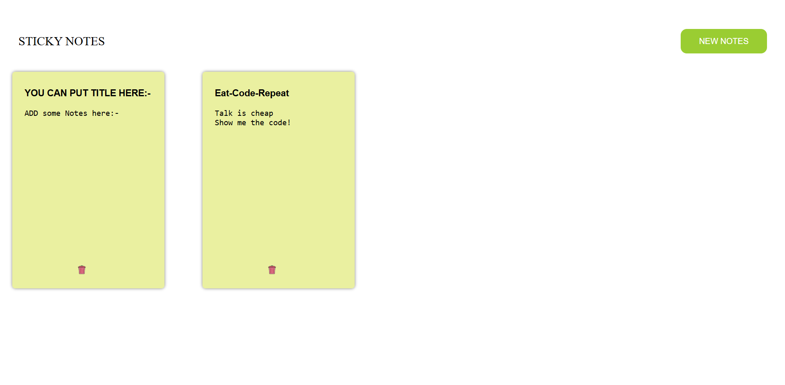

# Sticky Notepad 📝

A lightweight, browser-based sticky note application built with **Vanilla JavaScript**. This project allows users to create, edit, and delete digital sticky notes with seamless data persistence using the browser's LocalStorage.



## Features

* **Persistent Storage:** Uses `localStorage` to save your notes. Your data remains even after refreshing the page or closing the browser.
* **Dynamic Creation:** Add new notes instantly with a single click.
* **Real-time Auto-save:** Titles and content are updated in the background as you type.
* **Easy Deletion:** Remove individual notes quickly using the delete icon.
* **Clean UI:** A minimalist, responsive design with smooth hover effects and a "sticky note" aesthetic.

## Tech Stack

* **HTML5:** Structure and semantics.
* **CSS3:** Custom styling, Flexbox layout, and transitions.
* **JavaScript (ES6):** DOM manipulation, event handling, and LocalStorage logic.

## Project Structure

```text
├── img/
│   ├── favicon.png    # Site favicon
│   └── delete.png     # Delete icon for notes
├── index.html         # Main HTML structure
├── style.css          # UI styling and layout
└── script.js          # Core application logic
```
## How to Use

1. Clone the repository:
```Bash
git clone [https://github.com/Thorcha-Errox/Sticky-Notepad.git](https://github.com/Thorcha-Errox/Sticky-Notepad.git)
```
2. Open the project:
Simply open the `index.html` file in any modern web browser.

3. Create a Note: Click the "NEW NOTES" button.

4. Edit: Click on the title or body of the note and start typing; it saves automatically!

5. Delete: Click the trash icon at the bottom of a note to remove it permanently.

## How it Works
The application maintains a state array called `noteData`.

Initialization: On load, the app checks `localStorage` for existing data and renders it.

Update: Every keystroke (`onkeyup`) triggers a function that finds the specific note object by its ID and updates the storage.

Persistence: All data is stringified and stored under the key `"Storage"`.
